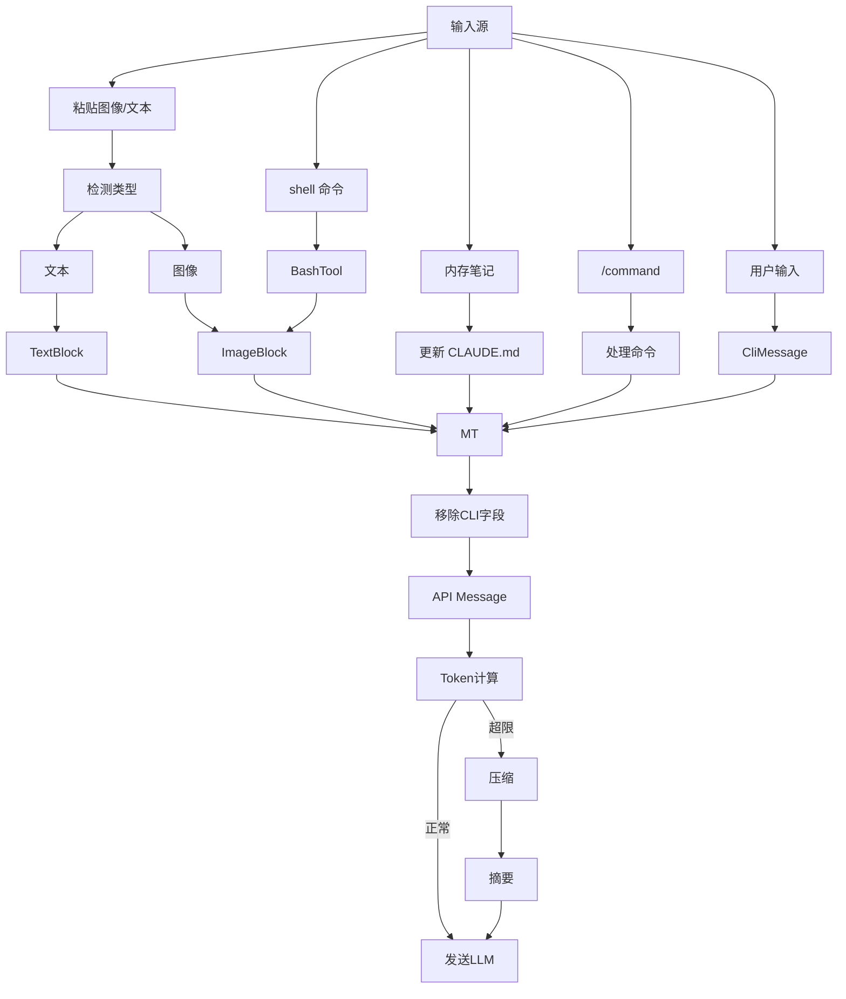
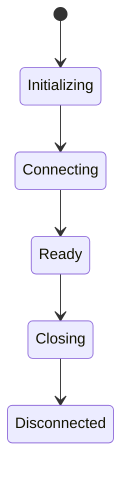

------

# Claude Code 架构深度解析

本篇主要是对这篇文章的解读：[Data Structures &amp; The Information Architecture](https://southbridge-research.notion.site/Data-Structures-The-Information-Architecture-2055fec70db1814ba2a7c5fa2879ac21)。也是因为最近开发Agent，所以研究了cc的架构和代码设计，cc还是很值得学习和借鉴的。

------

# 一、总体架构视角

Claude Code 不是一个“聊天工具”，而是一个：

> **事件驱动 + 流式处理 + 多层抽象的数据系统**

核心链路：

```text
用户输入
  ↓
ContentBlock（结构化内容）
  ↓
CliMessage（本地状态）
  ↓
API Message（协议格式）
  ↓
LLM（流式输出）
  ↓
Streaming Delta
  ↓
Accumulator（拼接）
  ↓
CliMessage（更新）
  ↓
UI 渲染
```

------

# 二、三层消息表示（Message Transform Pipeline）

## 2.1 设计目标

解决三个核心问题：

| 问题             | 解决方式    |
| ---------------- | ----------- |
| UI 需要丰富状态  | CLI Message |
| API 需要干净协议 | API Message |
| Streaming 不完整 | Accumulator |

------

## 2.2 三层结构

```ts
interface MessageTransformPipeline {
  // Stage 1: CLI Internal Representation
  cliMessage: {
    type: "user" | "assistant" | "attachment" | "progress"
    uuid: string
    timestamp: string
    message?: APICompatibleMessage
    attachment?: AttachmentContent
    progress?: ProgressUpdate
  }

  // Stage 2: API Wire Format
  apiMessage: {
    role: "user" | "assistant"
    content: string | ContentBlock[]
  }

  // Stage 3: Streaming Accumulator
  streamAccumulator: {
    partial: Partial<APIMessage>
    deltas: ContentBlockDelta[]
    buffers: Map<string, string>
  }
}
```

------

## 2.3 核心思想

### ✅ 1. 多表示层（Multi-representation）

同一条消息：

- CLI → UI状态
- API → 网络传输
- Streaming → 增量构建

------

### ✅ 2. Streaming ≠ Message

```text
Streaming = 生成过程
Message   = 最终结果
```

👉 必须有中间态（Accumulator）

------

------

# 三、Message Lifecycle（完整生命周期）

## 3.1 输入来源（多入口统一）



------

## 3.2 核心流程说明

### 1️⃣ 输入统一为 ContentBlock

```text
文本 → TextBlock
图像 → ImageBlock
命令 → ToolUseBlock
```

------

### 2️⃣ 转换为 API Message

移除 CLI 专属字段：

- uuid
- progress
- cost

------

### 3️⃣ Token 控制

```text
超限 → summary 压缩
```

------

### 4️⃣ Streaming 返回

```text
LLM → delta → accumulator → message
```

------

# 四、ContentBlock：统一内容模型

## 4.1 多态结构

```ts
type ContentBlock =
  | TextBlock
  | ImageBlock
  | ToolUseBlock
  | ToolResultBlock
  | ThinkingBlock
  | DocumentBlock
  | VideoBlock
  | GuardContentBlock
  | ReasoningBlock
  | CachePointBlock
```

------

## 4.2 核心思想

> ❗**消息 = 内容块数组，而不是字符串**

------

## 4.3 示例

```json
[
  { "type": "text", "text": "我来帮你查一下" },
  { "type": "tool_use", "name": "weather_api", "input": {"city":"Tokyo"} }
]
```

------

## 4.4 优势

### ✅ 结构化语义

不需要：

```text
regex / substring
```

------

### ✅ 多模态支持

- 文本
- 图片
- 视频

------

### ✅ 隐式信息

- thinking（不展示）
- guard（安全）

------

------

# 五、Streaming JSON 问题（核心难点）

## 5.1 问题本质

LLM 输出：

```json
{"city": "Tok
yo"}
```

👉 JSON 是“破碎的”

------

## 5.2 解决方案：Streaming JSON Parser

```ts
class StreamingToolInputParser {
  private buffer = ''
  private depth = 0
  private inString = false
  private escape = false

  addChunk(chunk: string) {
    this.buffer += chunk

    for (const char of chunk) {
      if (!this.inString) {
        if (char === '{') this.depth++
        if (char === '}') this.depth--
      }

      if (char === '"' && !this.escape) {
        this.inString = !this.inString
      }

      this.escape = char === '\\' && !this.escape
    }

    if (this.depth === 0) {
      try {
        return JSON.parse(this.buffer)
      } catch {
        if (this.inString) {
          return JSON.parse(this.buffer + '"')
        }
      }
    }
  }
}
```

------

## 5.3 关键机制

### 🧠 depth（结构闭合）

```text
{} [] 是否匹配
```

------

### 🧠 inString（字符串状态）

防止误判：

```json
"text }"
```

------

### 🧠 自动修复

```ts
buffer + '"'
```

------

------

# 六、Streaming 协议（基础）

## 6.1 SSE 数据格式

```text
data: {...}
data: {...}
```

------

## 6.2 处理流程

```ts
async *processStream(stream) {
  const reader = stream.getReader()
  let partial = ''

  while (true) {
    const { done, value } = await reader.read()
    if (done) break

    partial += decode(value)

    const lines = partial.split('\n')
    partial = lines.pop()

    for (const line of lines) {
      if (line.startsWith('data: ')) {
        yield JSON.parse(line.slice(6))
      }
    }
  }
}
```

------

## 6.3 核心问题解决

### ❗chunk 不完整

```text
data: {"a":1
}
```

👉 用 `partial` 拼接

------

------

# 七、Streaming Accumulator（消息构建器）

## 7.1 数据结构

```ts
streamAccumulator: {
  partial: Partial<APIMessage>
  deltas: ContentBlockDelta[]
  buffers: Map<string, string>
}
```

------

## 7.2 作用

| 字段    | 作用      |
| ------- | --------- |
| partial | 当前消息  |
| deltas  | 增量      |
| buffers | JSON 拼接 |

------

------

# 八、Mutation 控制（状态安全）

## 8.1 为什么要控制？

防止：

- 数据错乱
- 并发问题

------

## 8.2 三个允许修改点

------

### 1️⃣ Streaming 拼接

```ts
lastBlock.text += delta.text
```

------

### 2️⃣ Tool 结果注入

```ts
history.push({
  type: 'user',
  isMeta: true,
  content: [toolResult]
})
```

------

### 3️⃣ 成本计算

```ts
message.costUSD = calculateCost(...)
```

------

# 九、执行系统总览（从“说”到“做”）

在 Part 1 中，系统已经可以：

- 接收输入
- 构建消息
- 流式输出

但还缺一个关键能力：

> ❗**执行任务（而不仅仅是生成文本）**

------

## 🧠 执行链路

```text
LLM（决策）
  ↓
ToolUseBlock
  ↓
Tool / MCP
  ↓
ToolResultBlock
  ↓
注入对话
  ↓
LLM 下一轮
```

👉 这就是经典：

> **ReAct Loop（思考 → 行动 → 观察）**

------

# 十、ToolDefinition：工具系统核心抽象

## 10.1 完整结构

```ts
interface ToolDefinition {
  // Identity
  name: string
  description: string
  prompt?: string

  // Schema
  inputSchema: ZodSchema
  inputJSONSchema?: JSONSchema

  // Execution（关键）
  call: AsyncGenerator<ToolProgress | ToolResult, void, void>

  // Permission
  checkPermissions?: (...)

  // Output mapping
  mapToolResultToToolResultBlockParam: (...)

  // Metadata
  isReadOnly: boolean
  isMcp?: boolean

  // UI
  renderToolUseMessage?: (input) => ReactElement
}
```

------

## 10.2 核心设计点

------

### ✅ 1. 工具不是函数，而是“协议对象”

普通函数：

```ts
function readFile(path: string): string
```

Tool：

```text
函数 + 类型 + 权限 + streaming + UI
```

------

### ✅ 2. 双 Schema 设计

```ts
inputSchema: ZodSchema       // 程序用
inputJSONSchema: JSONSchema  // LLM 用
```

👉 本质：

> **一套给代码，一套给模型**

------

### ✅ 3. AsyncGenerator（关键）

```ts
call: AsyncGenerator<ToolProgress | ToolResult>
```

------

#### 为什么不是 Promise？

因为：

```text
工具执行是“过程”，不是“瞬间”
```

------

#### 示例

```ts
yield { type: "progress", message: "扫描中..." }
yield { type: "progress", message: "找到 120 个文件" }
return { result: files }
```

------

### ✅ 4. 输出统一进入 ContentBlock

```ts
mapToolResultToToolResultBlockParam(...)
```

👉 保证：

```text
工具输出 = 消息系统的一部分
```

------

------

# 十一、ToolUseContext：执行环境（运行时上下文）

## 11.1 结构

```ts
interface ToolUseContext {
  abortController: AbortController

  readFileState: Map<string, { content, timestamp }>

  getToolPermissionContext: () => ToolPermissionContext

  options: {
    tools
    mainLoopModel
    debug
    maxThinkingTokens
  }

  mcpClients?: McpClient[]
}
```

------

## 11.2 核心能力

------

### 🧠 1. 可取消执行

```ts
abortController
```

👉 支持：

- 用户中断
- 超时终止

------

### 📂 2. 文件缓存

```ts
readFileState
```

👉 避免重复 IO

------

### 🔌 3. MCP 接入点

```ts
mcpClients
```

👉 工具可以调用远程服务

------

------

# 十二、权限系统（安全核心）

## 12.1 权限上下文

```ts
interface ToolPermissionContext {
  mode: "default" | "acceptEdits" | "bypassPermissions"

  alwaysAllowRules
  alwaysDenyRules
}
```

------

## 12.2 分层优先级

```text
cliArg > local > project > policy > user
```

------

## 12.3 设计思想

> ❗**模型不能直接操作系统，必须经过权限层**

------

## 12.4 示例

```text
cliArg: 禁止删除文件
project: 允许删除 /tmp
```

👉 最终：

```text
❌ 禁止（高优先级覆盖）
```

------

------

# 十三、MCP：分布式工具协议

## 13.1 本质

> ❗**MCP = 远程工具调用协议（RPC）**

------

## 13.2 JSON-RPC 结构

```ts
interface McpRequest {
  jsonrpc: "2.0"
  id
  method
  params
}
```

------

## 13.3 示例

```json
{
  "method": "tools.call",
  "params": {
    "name": "read_file",
    "input": {...}
  }
}
```

------

## 13.4 Capability 协商

```ts
interface McpCapabilities {
  tools?: boolean
  resources?: boolean
  prompts?: boolean
  sampling?: boolean
}
```

------

## 13.5 核心能力

| 能力      | 作用         |
| --------- | ------------ |
| tools     | 提供工具     |
| resources | 提供数据     |
| prompts   | 动态 prompt  |
| sampling  | 反向调用 LLM |

------

------

# 十四、MCP 状态机



------

## 14.1 状态说明

| 状态         | 含义     |
| ------------ | -------- |
| Initializing | 初始化   |
| Connecting   | 建立连接 |
| Ready        | 可用     |
| Closing      | 关闭中   |
| Disconnected | 断开     |

------

------

# 十五、SessionState：全局状态系统

## 15.1 结构

```ts
interface SessionState {
  sessionId
  cwd

  totalCostUSD
  modelTokens

  mainLoopModelOverride

  sessionCounter
  locCounter
  commitCounter

  lastInteractionTime
}
```

------

## 15.2 核心作用

> ❗**让系统从“无状态”变成“有状态”**

------

## 15.3 分类

------

### 🧭 环境

- cwd
- sessionId

------

### 💰 成本

- totalCostUSD
- token usage

------

### 📊 行为

- locCounter
- commitCounter

------

### ⚠️ 状态

- rate limit fallback
- unknown cost

------

------

# 十六、双向 Streaming（核心通信）

## 16.1 协议结构

```ts
clientPayload: {
  bytes: string
  encoding: 'base64'
}
```

------

## 16.2 数据流

```text
Event → JSON → bytes → base64 → SSE
```

------

## 16.3 事件类型

```ts
ContentBlockDeltaEvent
ToolUseRequestEvent
ErrorEvent
MetadataEvent
```

------

## 16.4 处理流程

```ts
for each line:
  if "data: "
    parse JSON
    decode base64
    parse event
```

------

## 16.5 本质

> ❗**事件流系统（Event Streaming System）**

------

------

# 十七、性能优化体系（关键）

------

## 17.1 Lazy Parsing

```ts
parse(raw) {
  return JSON.parse(raw)
}
```

👉 只在访问时解析

------

## 17.2 String Intern

```ts
pool.set(str, str)
```

👉 相同字符串只存一份

------

## 17.3 WeakRef 缓存

```ts
Map<string, WeakRef<FileContent>>
```

👉 不阻止 GC

------

## 17.4 FinalizationRegistry

```ts
GC → 自动清理 cache
```

------

## 17.5 总策略

```text
延迟 + 共享 + 弱引用 + 自动回收
```

------

# 十八、完整执行链路

```text
用户输入
  ↓
System Prompt（动态组装）
  ↓
LLM
  ↓
Streaming Event
  ↓
ToolUseBlock
  ↓
Tool / MCP 执行
  ↓
ToolResultBlock
  ↓
注入 Message
  ↓
下一轮 LLM
```

------

# 十九、核心设计哲学总结

------

## 🌟 1. 一切皆流（Everything is streaming）

- token 流
- event 流
- 状态流

------

## 🌟 2. 一切皆结构（Everything is structured）

- ContentBlock
- Tool schema
- MCP protocol

------

## 🌟 3. 一切皆可扩展

- Tool
- MCP
- Prompt

------

## 🌟 4. LLM 是调度器

```text
LLM → 决策
Tool/MCP → 执行
```

------

